# Plan d'Intégration Messagerie - Plugin PC Reservation Core

> **Rapport d'audit complet et stratégie de raccordement Vue 3 ↔ PHP**  
> Généré le 17/03/2026 - Migration Frontend jQuery → Vue 3 + Pinia

---

## 1. État des lieux de l'existant

### 📁 Architecture des fichiers actuels

Le système de messagerie utilise une **architecture moderne en services** déjà bien structurée :

**Backend PHP - Services principaux :**

```
includes/services/messaging/
├── class-messaging-service.php           # Couche métier (envoi, réception, variables)
├── class-messaging-repository.php        # Couche données (requêtes SQL)
├── class-template-manager.php            # Gestion CPT et templates
└── class-notification-dispatcher.php     # Envoi physique (wp_mail + design)

includes/ajax/controllers/
└── class-messaging-ajax-controller.php   # API AJAX sécurisée

includes/
└── class-messaging.php                   # Façade legacy (zéro régression)
```

**Frontend Vue 3 - Déjà migré :**

```
src/services/
└── messaging-api.js                      # Client API HTTP

src/stores/
└── messaging-store.js                    # Store Pinia (basique)

templates/dashboard/
└── modal-messaging.php                   # Interface Channel Manager

assets/js/modules/
└── messaging.js                          # Legacy jQuery (à nettoyer)

assets/css/
└── dashboard-messaging.css               # CSS Channel Manager complet
```

### 🗄️ Système d'envoi d'emails actuel

**Moteur d'expédition :** `wp_mail()` native WordPress via `PCR_Notification_Dispatcher`

**Habillage HTML :** Template email responsive avec :

- Logo configurable (fallback en cascade)
- Design glassmorphisme cohérent
- Couleurs primaires personnalisables
- Signature automatique

**Support pièces jointes :**

- Documents natifs générés (devis, factures, contrats)
- Templates PDF personnalisés via CPT `pc_pdf_template`
- Upload de fichiers locaux (validation sécurisée)

### 🗂️ Structure de l'historique en base de données

**Table principale :** `wp_pc_messages` (architecture Channel Manager)

```sql
-- Colonnes critiques pour le multi-canal
canal VARCHAR(20) DEFAULT 'email'                    -- Type de canal
channel_source VARCHAR(50) DEFAULT 'email'           -- Source détaillée
direction VARCHAR(20) DEFAULT 'sortant'              -- sortant/entrant
sender_type ENUM('host', 'guest', 'system')          -- Expéditeur
conversation_id BIGINT(20) UNSIGNED                  -- Groupement conversation
external_id VARCHAR(191)                             -- ID externe (webhook)
metadata LONGTEXT                                    -- JSON (attachments, etc.)
```

**Point fort :** Migration automatique des anciens messages via `migrate_existing_messages()`

### 🎨 Gestion des templates d'emails

**CPT Templates :** `pc_message` avec configuration ACF avancée

**Catégories de templates :**

- `email_system` : Emails officiels (factures, confirmations)
- `quick_reply` : Réponses rapides WhatsApp/Chat

**Variables dynamiques supportées :**

```php
{prenom_client}, {nom_client}, {email_client}, {telephone}
{numero_resa}, {logement}, {date_arrivee}, {date_depart}
{montant_total}, {acompte_paye}, {solde_restant}
{lien_paiement_acompte}, {lien_paiement_solde}, {lien_paiement_caution}
```

---

## 2. Principe de fonctionnement actuel

### 📤 Flux d'envoi complet

```mermaid
graph LR
    A[Admin Dashboard] --> B[Channel Manager UI]
    B --> C[messaging-api.js]
    C --> D[PCR_Messaging_Ajax_Controller]
    D --> E[PCR_Messaging_Service]
    E --> F[Template Resolution]
    F --> G[Variables Replacement]
    G --> H[PCR_Notification_Dispatcher]
    H --> I[wp_mail + HTML Design]
    I --> J[BDD wp_pc_messages]
```



**Étapes détaillées :**

1. **Déclenchement** : Clic sur bouton "Messagerie" → Ouverture Channel Manager
2. **Chargement conversation** : AJAX `pc_get_conversation_history` → Affichage historique
3. **Composition message** : Interface multi-onglets (Chat/Email/Notes)
4. **Validation côté client** : Vérification sujet/corps selon onglet actif
5. **Envoi sécurisé** : AJAX `pc_send_message` avec nonce WordPress
6. **Traitement serveur** : Résolution template → Injection variables → Expédition
7. **Persistance** : Sauvegarde en BDD avec métadonnées canal
8. **Feedback temps réel** : Ajout instantané du message dans l'interface

### 🔄 Injection des variables dynamiques

**Moteur de remplacement** dans `PCR_Messaging_Service::send_message()` :

```php
// Récupération contexte réservation
$resa = PCR_Reservation::get_by_id($reservation_id);
$paid_amount = $repo->get_paid_amount($reservation_id);
$solde = (float)($resa->montant_total ?? 0) - $paid_amount;

// Mapping variables → valeurs
$vars = [
    '{nom_client}' => ucfirst($resa->prenom) . ' ' . strtoupper($resa->nom),
    '{montant_total}' => number_format((float)$resa->montant_total, 2, ',', ' ') . ' €',
    '{lien_paiement_acompte}' => $this->get_smart_link($resa->id, 'acompte'),
];

// Remplacement dans sujet et corps
$subject = strtr($subject, $vars);
$body = strtr(wpautop($body), $vars);
```

**Particularité :** Génération dynamique des liens Stripe avec mise à jour BDD automatique.

---

## 3. Stratégie de raccordement Vue 3 ↔ PHP

### 🏗️ Architecture cible recommandée

Le raccordement est **déjà fonctionnel** mais nécessite des améliorations :

**Modale Vue 3 existante** : `ReservationModal.vue` → Onglet "Messagerie"
**Interface Channel Manager** : `modal-messaging.php` (standalone, glassmorphisme)

**Recommandation :** Intégrer le Channel Manager **dans** ReservationModal.vue comme composant Vue.

### 🔌 Endpoints AJAX à optimiser/créer

**Existants (opérationnels) :**

```php
// Dans PCR_Messaging_Ajax_Controller
pc_send_message              // ✅ Envoi message (template/libre + PJ)
pc_get_conversation_history  // ✅ Historique complet + contexte résa
pc_mark_messages_read        // ✅ Marquer comme lus
pc_get_quick_replies         // ✅ Templates avec variables injectées
```

**À créer pour optimisation :**

```php
pc_get_conversation_summary  // Résumé léger (nb messages, dernière activité)
pc_search_conversations     // Recherche dans historique global
pc_export_conversation      // Export PDF/CSV d'une conversation
pc_set_conversation_tags    // Tags internes pour organisation
```

### 📱 Gestion du retour d'information Vue

**Store Pinia actuel** : `messaging-store.js` (basique)

**Améliorations nécessaires :**

```javascript
// État enrichi recommandé
state: () => ({
  currentConversation: [],
  conversationMetadata: {
    unreadCount: 0,
    lastActivity: null,
    participantInfo: null
  },
  quickReplies: [],
  attachmentOptions: [],
  sendingStatus: 'idle', // 'sending', 'success', 'error'
  realTimeUpdates: false,

  // Nouveaux états pour interface avancée
  activeTab: 'email', // 'email', 'whatsapp', 'notes'
  attachmentPreview: null,
  typingIndicator: false
})

// Actions optimisées
actions: {
  async sendMessage(payload) {
    this.sendingStatus = 'sending'
    try {
      const response = await messagingApi.sendMessage(payload)
      if (response.data.success) {
        // Ajout instantané sans recharger
        this.appendMessage(response.data.new_message)
        this.sendingStatus = 'success'
      }
    } catch (error) {
      this.sendingStatus = 'error'
      this.error = error.message
    }
  },

  enableRealTimeUpdates() {
    // Polling ou WebSocket pour messages entrants
  }
}
```

**Gestion des états de chargement** : Spinners, feedback visuel, retry automatique

---

## 4. Sécurité blindée (Critique)

### 🔒 Analyse de la sécurité actuelle

**Points forts identifiés :**

✅ **Héritage sécurisé** : `PCR_Messaging_Ajax_Controller extends PCR_Base_Ajax_Controller`  
✅ **Vérification nonces** : `parent::verify_access('pc_resa_manual_create', 'nonce')`  
✅ **Capacités WordPress** : Contrôle des droits administrateur  
✅ **Sanitisation native** : `sanitize_text_field()`, `wp_kses_post()`, `sanitize_email()`  
✅ **Validation uploads** : MIME types, taille, extension

**Vulnérabilités détectées à corriger :**

### 🚨 Renforcements sécuritaires obligatoires

**1. Validation stricte des pièces jointes :**

```php
// ACTUEL (faible)
$allowed_types = ['application/pdf', 'image/jpeg'];

// RECOMMANDÉ (strict)
private function validate_attachment_security($file) {
    // Double vérification MIME + extension
    $finfo = new finfo(FILEINFO_MIME_TYPE);
    $detected_mime = $finfo->file($file['tmp_name']);
    $declared_mime = $file['type'];

    if ($detected_mime !== $declared_mime) {
        return ['valid' => false, 'error' => 'MIME type mismatch'];
    }

    // Scan antivirus (si disponible)
    if (function_exists('clamdscan')) {
        $scan_result = clamdscan($file['tmp_name']);
        if ($scan_result !== 'OK') {
            return ['valid' => false, 'error' => 'Security threat detected'];
        }
    }

    // Vérification contenu (headers malveillants)
    $content_sample = file_get_contents($file['tmp_name'], false, null, 0, 1024);
    if (preg_match('/<\?php|<script|javascript:|data:/i', $content_sample)) {
        return ['valid' => false, 'error' => 'Malicious content detected'];
    }

    return ['valid' => true];
}
```

**2. Rate limiting anti-spam :**

```php
// Nouveau : Protection anti-flood
private function check_rate_limit($user_id, $reservation_id) {
    $cache_key = "msg_rate_limit_{$user_id}_{$reservation_id}";
    $sent_count = wp_cache_get($cache_key);

    if ($sent_count === false) {
        $sent_count = 0;
    }

    if ($sent_count >= 10) { // Max 10 messages/5min
        wp_send_json_error(['message' => 'Rate limit exceeded. Please wait.']);
    }

    wp_cache_set($cache_key, $sent_count + 1, '', 300); // 5 minutes
}
```

**3. Échappement HTML renforcé :**

```php
// Templates : Échappement selon contexte
$safe_content = wp_kses($raw_content, [
    'p' => [],
    'br' => [],
    'strong' => [],
    'em' => [],
    'a' => ['href' => [], 'title' => []]
]);

// URLs : Validation stricte
if (!empty($custom_url) && !wp_http_validate_url($custom_url)) {
    wp_send_json_error(['message' => 'Invalid URL provided']);
}
```

**4. Logs d'audit détaillés :**

```php
// Traçabilité complète des actions sensibles
private function log_messaging_action($action, $details) {
    error_log(sprintf(
        '[PC-MESSAGING-AUDIT] %s | User: %d | IP: %s | Details: %s',
        $action,
        get_current_user_id(),
        $_SERVER['REMOTE_ADDR'] ?? 'unknown',
        json_encode($details)
    ));
}
```

---

## 5. Plan de refactoring détaillé

### 🧹 Phase 1 : Nettoyage Legacy (2-3 jours)

**Fichiers à supprimer/moderniser :**

```bash
# À SUPPRIMER (legacy jQuery)
assets/js/modules/messaging.js              # → Logique migrée dans Vue
templates/dashboard/popups.php (partie msg) # → Channel Manager standalone

# À NETTOYER (code mort)
includes/class-messaging.php                # → Garder facade, nettoyer commentaires
```

**Code à refactoriser dans messaging.js :**

```javascript
// AVANT (jQuery legacy - à supprimer)
PCR.Messaging.attachEventListeners = function () {
  document.addEventListener("click", this.handleOpenMessageModal.bind(this));
  // 500+ lignes de jQuery legacy
};

// APRÈS (Vue 3 - déjà implémenté)
// La logique est dans messaging-store.js + ReservationModal.vue
```

### 🔧 Phase 2 : Optimisations Backend (3-4 jours)

**Nouvelles méthodes dans PCR_Messaging_Service :**

```php
class PCR_Messaging_Service {

    // NOUVEAU : Conversations bulk pour dashboard
    public function get_conversations_summary($limit = 50) {
        return $this->repository->get_recent_conversations_with_stats($limit);
    }

    // NOUVEAU : Recherche full-text
    public function search_messages($query, $reservation_id = null, $filters = []) {
        return $this->repository->search_full_text($query, $reservation_id, $filters);
    }

    // NOUVEAU : Notifications temps réel
    public function notify_new_external_message($reservation_id, $message_data) {
        // Push notification ou WebSocket si configuré
        do_action('pcr_new_message_received', $reservation_id, $message_data);
    }

    // OPTIMISATION : Cache conversations fréquentes
    public function get_conversation_cached($reservation_id) {
        $cache_key = "pcr_conversation_{$reservation_id}";
        $conversation = wp_cache_get($cache_key);

        if ($conversation === false) {
            $conversation = $this->get_conversation($reservation_id);
            wp_cache_set($cache_key, $conversation, '', 300); // 5min cache
        }

        return $conversation;
    }
}
```

**Nouveaux endpoints AJAX :**

```php
class PCR_Messaging_Ajax_Controller extends PCR_Base_Ajax_Controller {

    // NOUVEAU : Dashboard des conversations
    public static function ajax_get_conversations_dashboard() {
        parent::verify_access('pc_resa_manual_create', 'nonce');

        $service = PCR_Messaging_Service::get_instance();
        $conversations = $service->get_conversations_summary();

        wp_send_json_success($conversations);
    }

    // NOUVEAU : Recherche avancée
    public static function ajax_search_messages() {
        parent::verify_access('pc_resa_manual_create', 'nonce');

        $query = sanitize_text_field($_POST['query'] ?? '');
        $filters = [
            'channel' => sanitize_text_field($_POST['channel'] ?? ''),
            'date_from' => sanitize_text_field($_POST['date_from'] ?? ''),
            'date_to' => sanitize_text_field($_POST['date_to'] ?? '')
        ];

        $results = PCR_Messaging_Service::get_instance()->search_messages($query, null, $filters);
        wp_send_json_success($results);
    }
}
```

### 🎨 Phase 3 : Interface Vue Avancée (4-5 jours)

**Nouveau composant Vue : MessageCenter.vue**

```vue
<template>
  <div class="message-center">
    <!-- Onglets intelligents -->
    <TabNavigation
      :tabs="['email', 'whatsapp', 'notes']"
      :active-tab="activeTab"
      @tab-changed="switchTab"
    />

    <!-- Historique filtré par onglet -->
    <ConversationHistory
      :messages="filteredMessages"
      :loading="isLoading"
      @message-read="markAsRead"
    />

    <!-- Zone de composition adaptative -->
    <MessageComposer
      :mode="activeTab"
      :templates="availableTemplates"
      :attachments="attachmentOptions"
      @send-message="sendMessage"
      @file-upload="handleFileUpload"
    />

    <!-- Indicateurs temps réel -->
    <TypingIndicator v-if="isTyping" />
    <ConnectionStatus :status="connectionStatus" />
  </div>
</template>

<script>
import { useMessagingStore } from "@/stores/messaging-store";
import { computed, onMounted, onUnmounted } from "vue";

export default {
  name: "MessageCenter",
  props: {
    reservationId: {
      type: Number,
      required: true,
    },
  },

  setup(props) {
    const store = useMessagingStore();

    // États réactifs
    const activeTab = computed(() => store.activeTab);
    const filteredMessages = computed(() =>
      store.currentConversation.filter(
        (msg) => msg.channel_source === activeTab.value,
      ),
    );

    // Actions
    const sendMessage = async (payload) => {
      await store.sendMessage({
        ...payload,
        reservation_id: props.reservationId,
        channel: activeTab.value,
      });
    };

    // Cycle de vie
    onMounted(() => {
      store.fetchConversation(props.reservationId);
      store.enableRealTimeUpdates();
    });

    onUnmounted(() => {
      store.disableRealTimeUpdates();
    });

    return {
      activeTab,
      filteredMessages,
      sendMessage,
      switchTab: store.switchTab,
      markAsRead: store.markAsRead,
    };
  },
};
</script>
```

**Store Pinia optimisé :**

```javascript
// messaging-store.js - Version complète
export const useMessagingStore = defineStore("messaging", {
  state: () => ({
    // États existants
    currentConversation: [],
    reservationContext: null,
    quickReplies: [],

    // Nouveaux états
    activeTab: "email",
    attachmentOptions: [],
    realTimeConnection: null,
    conversationCache: new Map(),
    sendQueue: [],

    // États UX
    isLoading: false,
    isSending: false,
    isTyping: false,
    connectionStatus: "connected",
    error: null,
  }),

  getters: {
    filteredMessages: (state) => {
      return state.currentConversation.filter(
        (message) => message.channel_source === state.activeTab,
      );
    },

    unreadCount: (state) => {
      return state.currentConversation.filter(
        (msg) => !msg.is_read && msg.direction === "entrant",
      ).length;
    },

    hasUnsent: (state) => state.sendQueue.length > 0,
  },

  actions: {
    async sendMessage(payload) {
      this.isSending = true;
      this.error = null;

      try {
        // Ajout optimiste à l'interface
        const optimisticMessage = this.createOptimisticMessage(payload);
        this.currentConversation.push(optimisticMessage);

        // Envoi réel
        const response = await messagingApi.sendMessage(payload);

        if (response.data.success) {
          // Remplacer le message optimiste par le réel
          this.replaceOptimisticMessage(
            optimisticMessage.id,
            response.data.new_message,
          );
        } else {
          throw new Error(response.data.message);
        }
      } catch (error) {
        this.error = error.message;
        // Marquer le message optimiste comme échec
        this.markMessageAsFailed(optimisticMessage.id);
      } finally {
        this.isSending = false;
      }
    },

    enableRealTimeUpdates() {
      // Implémentation WebSocket ou polling selon infrastructure
      if (window.WebSocket) {
        this.connectWebSocket();
      } else {
        this.startPolling();
      }
    },

    // Cache intelligent
    async fetchConversation(reservationId, fromCache = true) {
      const cacheKey = `conversation_${reservationId}`;

      if (fromCache && this.conversationCache.has(cacheKey)) {
        const cached = this.conversationCache.get(cacheKey);
        if (Date.now() - cached.timestamp < 300000) {
          // 5min
          this.currentConversation = cached.data;
          return;
        }
      }

      // Fetch depuis API
      await this.fetchHistoryFromAPI(reservationId);

      // Mise en cache
      this.conversationCache.set(cacheKey, {
        data: this.currentConversation,
        timestamp: Date.now(),
      });
    },
  },
});
```

### 🔌 Phase 4 : Intégration & Tests (2-3 jours)

**Tests de régression :**

- Envoi emails classiques (templates existants)
- Variables dynamiques (tous les placeholders)
- Pièces jointes (natifs + uploads)
- Sécurité (nonces, sanitisation, rate limiting)
- Performance (cache, requêtes optimisées)

**Tests d'intégration Vue :**

- Réactivité store Pinia
- Synchronisation onglets
- Gestion erreurs réseau
- Feedback visuel temps réel

---

## 🎯 Recommandations de mise en œuvre

### Priorité 1 (Critique) - Sécurité

1. Implémenter la validation stricte des uploads (scan malware)
2. Ajouter le rate limiting anti-spam
3. Renforcer l'échappement HTML selon contexte
4. Mettre en place les logs d'audit détaillés

### Priorité 2 (Performance) - Cache & Optimisation

1. Cache conversations fréquentes (Redis/Memcached si possible)
2. Lazy loading des templates dans l'interface
3. Pagination intelligente des historiques longs
4. Compression des métadonnées JSON

### Priorité 3 (UX) - Interface Avancée

1. Intégrer MessageCenter.vue dans ReservationModal
2. Notifications temps réel (WebSocket ou polling)
3. Recherche full-text dans conversations
4. Export PDF des conversations

### Priorité 4 (Évolutivité) - Extensions Futures

1. API REST publique pour intégrations tierces
2. Support webhooks entrants (Brevo, Mailgun, etc.)
3. Templates conditionnels avancés
4. Analyses statistiques des échanges

---

**Temps estimé total : 12-15 jours**  
**Complexité : Moyenne** (architecture déjà solide)  
**Risque : Faible** (système existant fonctionnel)

> ✅ **Conclusion :** Le système de messagerie est déjà techniquement abouti. La migration Vue 3 nécessite principalement du nettoyage legacy et des optimisations UX/sécurité plutôt qu'une refonte complète.
