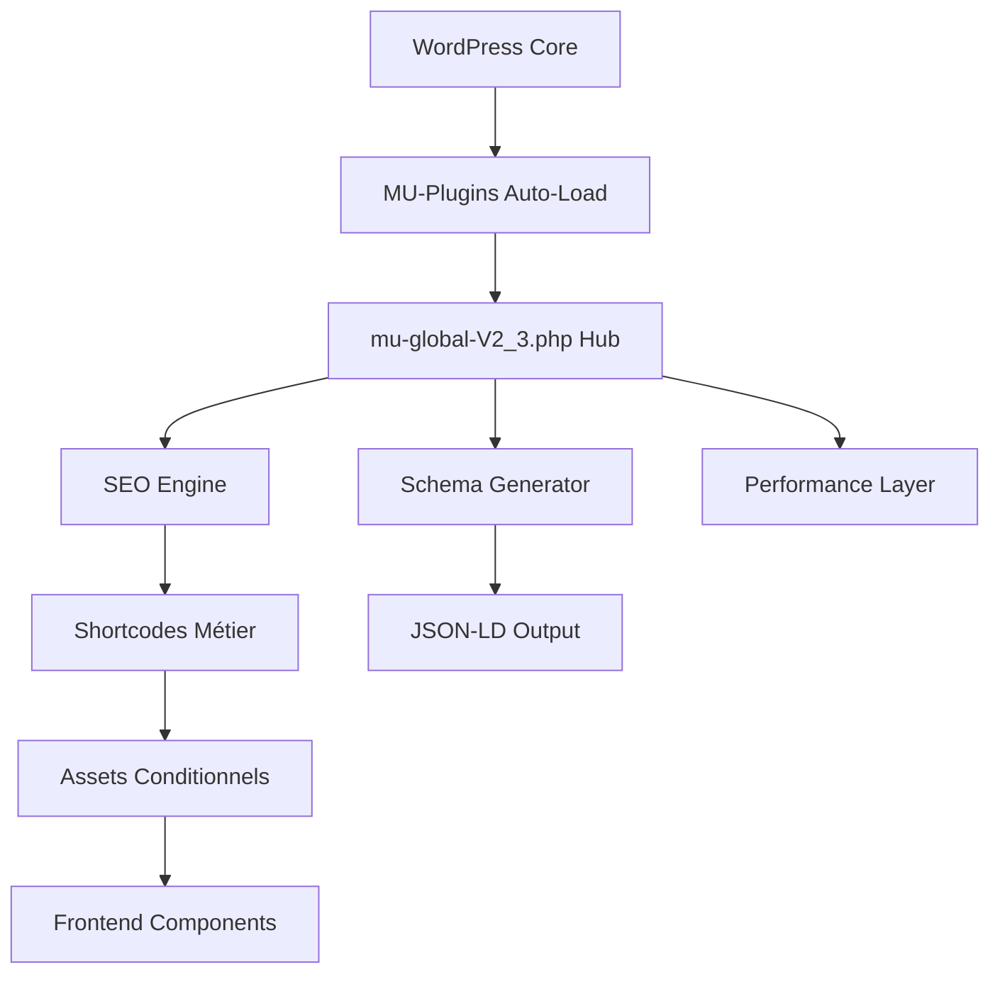
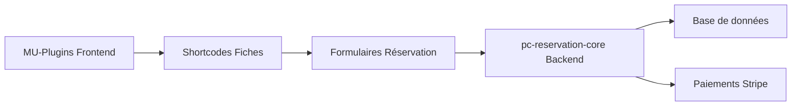

# 🏗️ Architecture MU-Plugins Prestige Caraïbes

**Version :** V2.4 - Architecture Modulaire  
**Auteur :** PC SEO & Développement  
**Date d'analyse :** 28/02/2026  
**Type :** Must-Use Plugins WordPress - Écosystème modulaire refactorisé

---

## 📋 Vue d'ensemble

Les **MU-Plugins** (Must-Use Plugins) constituent l'écosystème fonctionnel principal de Prestige Caraïbes. Ces plugins se chargent automatiquement avant tous les autres plugins et gèrent les fonctionnalités critiques du site : SEO technique, schémas JSON-LD, shortcodes métier, et composants UI.

### 🎯 Responsabilités principales

- **SEO technique avancé** : Meta robots, sitemaps, canonicals, schémas JSON-LD
- **Shortcodes métier** : Fiches logements, expériences, recherches
- **Composants UI** : Galeries, calendriers, formulaires de réservation
- **Intégrations externes** : Lodgify, Stripe, APIs cartographiques
- **Performance** : Optimisations CSS/JS conditionnelles

---

## 📊 Statistiques du projet

### 📈 Lignes de code par catégorie

| **Catégorie**          | **Fichiers** | **Lignes**        | **% du total** |
| ---------------------- | ------------ | ----------------- | -------------- |
| **Core PHP**           | 28 fichiers  | **11,327 lignes** | **59.6%**      |
| **Assets CSS**         | 9 fichiers   | **5,611 lignes**  | **29.5%**      |
| **Assets JS**          | 10 fichiers  | **2,074 lignes**  | **10.9%**      |
| **Configuration JSON** | 10 fichiers  |                   | **Metadata**   |

**Total mu-plugins : 19,012 lignes**  
**Fichier le plus volumineux : mu-global-prestige-caraibesV2_3.php (3,061 lignes)**

---

## 🗂️ Structure détaillée (Architecture Modulaire V2.4 → V2.5)

```
mu-plugins/
├── 📄 mu-global-prestige-caraibesV2_3.php    (73 lignes)     ⭐ Hub orchestrateur V3.0 (Refactorisé ✅)
├── 📄 pc-custom-typesV3.php                  (207 lignes)    - CPTs & Taxonomies
├── 📄 pc-acf.php                             (33 lignes)     - Configuration ACF
├── 📄 pc-logement-loader.php                 (3 lignes)      - Point d'entrée logements
├── 📄 pc-experiences-loader.php              (15 lignes)     - Point d'entrée expériences
├── 📄 pc-destination-loader.php              (3 lignes)      - Point d'entrée destinations
├── 📄 pc-recherche-loader.php                (3 lignes)      - Point d'entrée recherche
├── 📄 pc-header-loader.php                   (3 lignes)      - Point d'entrée header
│
├── 📂 core-modules/ ⭐                       - Modules système (Refactorisé ✅)
│   ├── class-pc-assets.php                   - Gestionnaire assets
│   ├── class-pc-performance.php              - Optimisations
│   ├── class-pc-seo-helpers.php              - Helpers SEO
│   ├── class-pc-seo-manager.php              - SEO technique avancé
│   ├── class-pc-jsonld-manager.php           - Schémas JSON-LD
│   └── class-pc-social-manager.php           - Réseaux sociaux
│
├── 📂 pc-destination/ ⭐                     - Module Destinations (Refactorisé ✅)
│   ├── pc-destination-core.php               (156 lignes)    - Core avec autoloading
│   ├── 📂 assets/
│   │   ├── class-pc-destination-asset-manager.php - Gestionnaire assets
│   │   └── 📂 css/components/                - Composants CSS destinations
│   ├── 📂 shortcodes/                        - 5 classes shortcodes spécialisées
│   │   ├── class-pc-destination-hub-shortcode.php     - Hub destinations
│   │   ├── class-pc-destination-logements-shortcode.php - Logements recommandés
│   │   ├── class-pc-destination-experiences-shortcode.php - Expériences associées
│   │   ├── class-pc-destination-infos-shortcode.php   - Informations pratiques
│   │   └── class-pc-destination-recommendations-shortcode.php - Recommandations
│   ├── 📂 helpers/                           - Classes utilitaires destinations
│   │   ├── class-pc-destination-query-helper.php - Helper requêtes
│   │   └── class-pc-destination-render-helper.php - Helper rendu
│   └── 📂 schema/
│       └── class-pc-destination-schema-manager.php - Schémas JSON-LD destinations
│
├── 📂 pc-experiences/ ⭐                     - Module Expériences (Refactorisé ✅)
│   ├── pc-experiences-core.php               (116 lignes)    - Core avec classes
│   ├── 📂 assets/
│   │   ├── class-pc-asset-manager-exp.php    - Gestionnaire assets spécialisé
│   │   ├── 📂 css/components/                - 15+ composants CSS
│   │   │   ├── pc-experience-*.css           - Composants expériences
│   │   │   ├── pc-booking-*.css              - Réservation expériences
│   │   │   └── pc-anchor-menu.css            - Navigation
│   │   └── 📂 js/
│   │       ├── 📂 components/                - Composants JS expériences
│   │       └── 📂 modules/                   - Modules spécialisés
│   ├── 📂 shortcodes/                        - 9 classes shortcodes spécialisées
│   │   ├── class-pc-experience-shortcode-base.php - Classe de base
│   │   ├── class-pc-booking-shortcode.php    - Réservation
│   │   ├── class-pc-gallery-shortcode.php    - Galeries
│   │   └── 6 autres classes...
│   ├── 📂 booking/                           - Handler réservation expériences
│   └── 📂 helpers/                           - Helpers métier spécialisés
│
├── 📂 pc-header/ ⭐                          - Module Header (Refactorisé ✅)
│   ├── pc-header-core.php                    (145 lignes)    - Core avec autoloading
│   ├── 📂 assets/
│   │   ├── class-pc-header-asset-manager.php - Gestionnaire assets header
│   │   ├── 📂 css/
│   │   │   ├── header-main.css               - Styles principaux
│   │   │   └── 📂 components/                - 6 composants CSS header
│   │   └── 📂 js/
│   │       ├── header-main.js                - Script principal
│   │       └── 📂 components/                - 5 composants JS header
│   ├── 📂 shortcodes/
│   │   └── class-pc-header-shortcode.php     - Shortcode header principal
│   ├── 📂 helpers/                           - 3 classes helper header
│   │   ├── class-pc-header-menu-helper.php   - Helper menus
│   │   ├── class-pc-header-render-helper.php - Helper rendu
│   │   └── class-pc-header-svg-helper.php    - Helper SVG
│   ├── 📂 config/
│   │   └── class-pc-header-config.php        - Configuration header
│   └── 📂 api/
│       └── class-pc-header-search-api.php    - API recherche header
│
├── 📂 pc-logement/ ⭐                        - Module Logements (Refactorisé ✅)
│   ├── pc-logement-core.php                  (162 lignes)    - Core avec autoloading
│   ├── 📂 assets/
│   │   ├── class-pc-asset-manager.php        - Gestionnaire assets
│   │   ├── 📂 css/components/                - Composants CSS spécialisés
│   │   │   ├── pc-gallery.css                - Galeries photos
│   │   │   ├── pc-booking-*.css              - Composants réservation
│   │   │   ├── pc-calendar.css               - Calendrier
│   │   │   ├── pc-devis.css                  - Calculateur prix
│   │   │   └── 12 autres fichiers CSS...
│   │   └── 📂 js/
│   │       ├── pc-logement-core.js           - Orchestrateur principal
│   │       ├── 📂 components/                - Composants JS modulaires
│   │       ├── 📂 modules/                   - Modules métier
│   │       └── 📂 utils/                     - Utilitaires
│   ├── 📂 shortcodes/                        - Classes shortcodes spécialisées
│   │   ├── class-pc-shortcode-base.php       - Classe de base
│   │   ├── class-pc-gallery-shortcode.php    - Galeries
│   │   ├── class-pc-devis-shortcode.php      - Calculateur
│   │   └── 8 autres classes shortcodes...
│   ├── 📂 booking/                           - Logique réservation
│   └── 📂 helpers/                           - Classes utilitaires
│
├── 📂 pc-recherche/ ⭐                       - Module Recherche (Refactorisé ✅)
│   ├── pc-recherche-core.php                 (143 lignes)    - Core avec autoloading
│   ├── 📂 assets/
│   │   ├── class-pc-search-asset-manager.php - Gestionnaire assets recherche
│   │   ├── 📂 css/components/                - Composants CSS recherche
│   │   └── 📂 js/modules/                    - Modules JS recherche
│   ├── 📂 ajax/
│   │   └── class-pc-search-ajax-handler.php  - Handler AJAX recherche
│   ├── 📂 shortcodes/                        - Classes shortcodes recherche
│   ├── 📂 engines/                           - Moteurs de recherche
│   └── 📂 helpers/                           - Helpers recherche
│
├── 📂 pc-reviews/ ⭐                         - Module Avis (Refactorisé ✅)
│   ├── pc-reviews.php                        (406 lignes)    - Core fonctions
│   └── 📂 assets/
│       ├── css/pc-reviews.css                - Styles avis
│       └── js/pc-reviews.js                  - Interactions AJAX
│
├── 📂 composants/ (🚨 Legacy - À Refactoriser)
│   ├── 📄 pc-faq-capture.php                 (263 lignes)    - FAQ dynamiques (🔄 À refactoriser)
│   ├── 📄 pc-loop-components.php             (85 lignes)     - Vignettes grilles (🔄 À refactoriser)
│   ├── 📄 shortcode-liste-logement.php       (92 lignes)     - Liste logements dropdown (🔄 À refactoriser)
│   ├── 📄 pc-perf-hints.php                  (422 lignes)    - Optimisations performance (🔄 À optimiser)
│   ├── 📄 pc-maintenance.php                 (267 lignes)    - Mode maintenance (✅ Bien structuré)
│   ├── 📄 pc-ical-cache.php                  (119 lignes)    - Cache iCal (🔄 À optimiser)
│   ├── 📄 pc-fallback-bientot-disponible.php - Fallback pages (🔄 À analyser)
│   └── 📄 pc-sandbox-menu-prefix.php         - Menu dev/sandbox (🔄 À analyser)
│
├── 📂 assets/ (🔄 Globaux - À organiser)     - Assets partagés
│   ├── pc-base.css                           (224 lignes)    - Variables CSS globales
│   ├── pc-orchestrator.js                    (118 lignes)    - Coordinateur global
│   ├── pc-faq-capture.css                    - Styles FAQ
│   ├── pc-gallerie.js                        - Script galeries
│   ├── pc-loop-card.css                      - Styles cartes
│   ├── shortcode-liste-logement.css          - Styles dropdown
│   ├── shortcode-liste-logement-v2.js        - Script dropdown
│   └── 📂 js/modules/                        - Modules JS globaux
└── 📂 pc-acf-json/                          - Configuration ACF
    ├── group_pc_fiche_logement.json          - Champs logements
    ├── group_pc_reviews.json                 - Champs avis
    └── Autres groupes ACF...
```

**Légende :**

- ⭐ = Modules refactorisés et optimisés
- ✅ = Architecture modulaire complète
- 🔄 = Nécessite refactoring/optimisation
- 🚨 = Legacy, structure obsolète

---

## 🏛️ Architecture fonctionnelle

### 🎯 Pattern architectural : **Modular Monolith + Event-Driven**

Les MU-plugins suivent une architecture modulaire avec spécialisation par domaine métier :



### 🔧 Modules principaux

#### 1. **Hub Central** (`mu-global-prestige-caraibesV2_3.php` - V3.0 Refactorisé !)

**Transformation majeure : 3,061 lignes → 73 lignes !**

**Nouvelle Architecture V3.0 - Orchestrateur Ultra-Léger :**

- **Chargement CSS global de base** : pc-base.css avec variables
- **Auto-loading des core-modules/** : 6 modules système spécialisés
- **Initialisation Singletons** : Performance, SEO, JSON-LD, Social managers
- **73 lignes** - Orchestrateur pur, plus de monolithe !

**Logique extraite vers `core-modules/` :**

- `class-pc-assets.php` - Gestionnaire assets
- `class-pc-performance.php` - Optimisations
- `class-pc-seo-helpers.php` - Helpers SEO
- `class-pc-seo-manager.php` - SEO technique avancé
- `class-pc-jsonld-manager.php` - Schémas JSON-LD
- `class-pc-social-manager.php` - Réseaux sociaux

#### 2. **Modules Refactorisés** ⭐ Nouvelle Architecture Modulaire

- **Module Logements** (`pc-logement/` - Refactorisé V2.4)
  - **Core** : `pc-logement-core.php` (162 lignes) avec autoloading et pattern Singleton
  - **Shortcodes** : Classes spécialisées (Gallery, Devis, Tarifs, etc.)
  - **Assets** : Gestionnaire dédié + composants CSS/JS modulaires
  - **Booking** : Logic métier séparée pour réservations
  - Remplace l'ancien `shortcode-page-fiche-logement.php` monolithique

- **Module Expériences** (`pc-experiences/` - Refactorisé V2.4)
  - **Core** : `pc-experiences-core.php` (116 lignes) avec initialisation modulaire
  - **Shortcodes** : 9 classes spécialisées héritant de `PC_Experience_Shortcode_Base`
  - **Assets** : Gestionnaire expériences + 15+ composants CSS
  - **Booking** : Handler réservation expériences dédié
  - Remplace l'ancien `shortcode-page-fiche-experiences.php` monolithique

- **Module Reviews** (`pc-reviews/` - Refactorisé V2.4)
  - **Core** : `pc-reviews.php` (406 lignes) optimisé
  - **Assets** : CSS/JS dédiés pour interactions AJAX
  - Structure propre et maintenable

- **Destinations** (`pc-destination-shortcodes.php` - 499 lignes)
  - Hubs, grilles, logements/expériences recommandés
  - **À refactoriser** : Prochain sur la roadmap

#### 3. **Framework UI** (`assets/css/`)

- **pc-ui.css** (2,288 lignes) : Framework CSS principal avec variables
- **pc-ui-experiences.css** (1,370 lignes) : Composants spécialisés expériences
- **pc-header-global.css** (1,011 lignes) : Navigation responsive uniforme

#### 4. **Moteurs de Recherche** (1,047 lignes)

- **Recherche Expériences** (`pc-experience-search.php` + assets)
- **Recherche Logements** (`pc-search-shortcodes.php` + assets)
- **AJAX avancé** avec filtres dynamiques et géolocalisation

---

## 🔄 Flux de données et intégrations

### 📍 Cycle de rendu d'une page produit

```
1. [WordPress] Chargement MU-plugins automatique
   ↓
2. [mu-global] Initialisation SEO + schémas
   ↓
3. [shortcode-fiche] Rendu contenu métier
   ↓
4. [Assets JS] Chargement conditionnel composants
   ↓
5. [API externes] Lodgify, Stripe, Leaflet, Flatpickr
   ↓
6. [JSON-LD] Injection schémas dans <head>
```

### 🎛️ Points d'intégration externes

| **Service**     | **Usage**                   | **Fichiers concernés**              |
| --------------- | --------------------------- | ----------------------------------- |
| **Lodgify**     | Réservations directes       | `shortcode-page-fiche-logement.php` |
| **Stripe**      | Paiements + cautions        | `pc-devis.js`                       |
| **iCal/ICS**    | Synchronisation calendriers | `pc-ical-cache.php`                 |
| **Leaflet**     | Cartes interactives         | `shortcode-*.php`                   |
| **Flatpickr**   | Sélecteurs de dates         | Assets JS                           |
| **GLightbox**   | Galeries photos             | `pc-gallerie.js`                    |
| **FontAwesome** | Iconographie                | Chargement conditionnel             |

---

## 🎨 Patterns et conventions

### 1. **Chargement conditionnel des assets**

```php
// Pattern répété : chargement intelligent selon le contexte
add_action('wp_enqueue_scripts', function () {
  if (! is_singular(['villa', 'appartement', 'logement'])) {
    return; // Pas de chargement inutile
  }
  wp_enqueue_style(...);
});
```

### 2. **Shortcodes avec configuration avancée**

```php
// Configuration data-driven pour composants complexes
add_shortcode('pc_devis', function ($atts = []) {
  $cfg = [
    'basePrice'   => $base_price,
    'seasons'     => $seasons_data,
    'icsDisable'  => $availability_ranges,
    'payment'     => $payment_config
  ];
  return '<section data-pc-devis="' . esc_attr(wp_json_encode($cfg)) . '">';
});
```

### 3. **SEO modulaire et extensible**

```php
// Système de schémas JSON-LD avec helpers réutilisables
function pcseo_get_meta($post_id, $suffix) {
  // Lecture multi-format (ACF group/subfield + fallbacks)
}
```

---

## ⚡ Performance et optimisations

### 🚀 Stratégies d'optimisation

| **Technique**                   | **Implémentation**           | **Gain estimé**   |
| ------------------------------- | ---------------------------- | ----------------- |
| **Chargement conditionnel**     | Assets par contexte page     | **-60% JS/CSS**   |
| **Variables CSS natives**       | `pc-base.css` avec `:root`   | **-30% taille**   |
| **Préchargement polices**       | `mu-global` anticipé         | **+200ms LCP**    |
| **Suppression bloat Gutenberg** | Désactivation conditionnelle | **-150KB**        |
| **Cache iCal intelligent**      | `pc-ical-cache.php` avec TTL | **-2s loading**   |
| **Minification runtime**        | Assets avec filemtime()      | **Cache optimal** |

### 🐌 Points d'amélioration identifiés

| **Problème**               | **Impact**         | **Solution/État**                         |
| -------------------------- | ------------------ | ----------------------------------------- |
| ~~Fichiers monolithiques~~ | ~~Maintenance~~    | ✅ **Résolu V2.4** - Modules refactorisés |
| Dépendances CDN multiples  | SPOF + latence     | Self-hosting critique                     |
| JS inline volumineux       | Caching impossible | Externalisation                           |
| Schémas JSON-LD redondants | DOM pollution      | Déduplication intelligente                |

### 🎉 **Améliorations V2.4 - Architecture Modulaire**

| **Amélioration**              | **Avant (V2.3)**                      | **Après (V2.4)**                             |
| ----------------------------- | ------------------------------------- | -------------------------------------------- |
| **Hub central mu-global**     | 1 fichier monolithique (3,061 lignes) | ⭐ **Orchestrateur ultra-léger (73 lignes)** |
| **Structure logements**       | 1 fichier monolithique (2,281 lignes) | Module avec 10+ classes spécialisées         |
| **Structure expériences**     | 1 fichier monolithique (1,053 lignes) | Module avec 9+ classes + assets modulaires   |
| **Structure reviews**         | Code mélangé dans mu-global           | Module dédié avec assets propres             |
| **Gestion assets**            | Chargement global                     | Asset managers dédiés par module             |
| **Modules système**           | Code mélangé dans mu-global           | 6 classes dans `core-modules/`               |
| **Maintenabilité**            | Difficile (code mélangé)              | Excellente (séparation claire)               |
| **Réutilisabilité**           | Limitée                               | Classes de base héritables                   |
| **Testabilité**               | Impossible                            | Classes isolées testables                    |
| **Performance développement** | Lente (fichiers énormes)              | Rapide (fichiers ciblés)                     |

---

## 🔐 Sécurité et bonnes pratiques

### ✅ Mesures implémentées

- **Nonces WordPress** : Protection CSRF sur tous les formulaires
- **Sanitization complète** : `sanitize_text_field()`, `wp_kses_post()`
- **Capability checks** : Vérification permissions administrateur
- **Anti-bot honeypots** : Champs cachés dans formulaires
- **Rate limiting** : Via plugins externes + validation côté serveur
- **Échappement output** : `esc_html()`, `esc_attr()`, `esc_url()`

### 🛡️ Recommandations sécurité

- [ ] **Audit XSS** : Scanner tous les shortcodes pour injections
- [ ] **CSRF avancé** : Implémenter tokens rotatifs
- [ ] **Input validation** : Whitelist stricte champs ACF
- [ ] **SQL injection** : Audit requêtes custom avec `$wpdb`

---

## 📦 Dépendances et intégrations

### 🔌 Plugins WordPress requis

- **Advanced Custom Fields Pro** : Gestion des métadonnées
- **Elementor Pro** : Constructeur de pages
- **WP Rocket** : Cache + optimisations (optionnel)

### 🌐 Services externes (CDN)

```javascript
// Dépendances critiques chargées via CDN
"https://unpkg.com/leaflet@1.9.4/dist/leaflet.css";
"https://cdn.jsdelivr.net/npm/flatpickr/dist/flatpickr.min.css";
"https://cdn.jsdelivr.net/npm/glightbox/dist/css/glightbox.min.css";
"https://cdnjs.cloudflare.com/ajax/libs/font-awesome/6.5.2/css/all.min.css";
```

### 🛠️ APIs et Webhooks

- **Stripe API** : Paiements, cautions, webhooks
- **Lodgify API** : Synchronisation réservations
- **OpenStreetMap** : Tiles cartographiques
- **Email providers** : SMTP pour notifications

---

## 🧪 Qualité du code

### 📊 Métriques de complexité

| **Fichier**                            | **Lignes** | **Fonctions** | **Complexité** |
| -------------------------------------- | ---------- | ------------- | -------------- |
| `mu-global-prestige-caraibesV2_3.php`  | 3,061      | ~80           | **Élevée**     |
| `shortcode-page-fiche-logement.php`    | 2,281      | ~25           | **Élevée**     |
| `pc-ui.css`                            | 2,288      | N/A           | **Moyenne**    |
| `shortcode-page-fiche-experiences.php` | 1,053      | ~15           | **Moyenne**    |

### ❌ Dette technique identifiée

1. **Fonctions gigantesques** : Certaines fonctions dépassent 200 lignes
2. **Code dupliqué** : Patterns similaires entre logements/expériences
3. **Configuration hardcodée** : Magic numbers et strings
4. **Absence de tests** : Aucun test automatisé
5. **Documentation manquante** : Peu de docblocks PHP

---

## 🛠️ Plan de Refactoring - Fichiers Restants (Q2 2026)

### 🎯 **Phase 1 : Refactoring Priorité Haute (2-3 semaines)**

#### 1. **Module FAQ** (`pc-faq/`)

**Fichier actuel :** `pc-faq-capture.php` (263 lignes)
**Problèmes identifiés :**

- Code monolithique avec logique mélangée
- Gestion CSS inline problématique
- Absence de classes réutilisables

**Architecture cible :**

```
📂 pc-faq/
├── pc-faq-core.php                    - Core avec autoloading
├── 📂 shortcodes/
│   ├── class-pc-faq-shortcode-base.php    - Classe de base
│   ├── class-pc-faq-render-shortcode.php  - Shortcode [pc_faq_render]
│   ├── class-pc-destination-faq-shortcode.php - [destination_faq]
│   ├── class-pc-experience-faq-shortcode.php  - [experience_faq]
│   └── class-pc-logement-faq-shortcode.php    - [logement_faq]
├── 📂 assets/
│   ├── class-pc-faq-asset-manager.php - Gestionnaire assets
│   ├── 📂 css/
│   │   └── pc-faq.css                 - Styles FAQ (externalisé)
│   └── 📂 js/
│       └── pc-faq.js                  - Interactions accordéon
└── 📂 helpers/
    └── class-pc-faq-render-helper.php - Helper rendu FAQ
```

#### 2. **Module UI Components** (`pc-ui-components/`)

**Fichier actuel :** `pc-loop-components.php` (85 lignes)
**Problèmes identifiés :**

- Logique vignettes non réutilisable
- Pas de gestionnaire assets dédié
- Code HTML inline complexe

**Architecture cible :**

```
📂 pc-ui-components/
├── pc-ui-components-core.php          - Core avec autoloading
├── 📂 shortcodes/
│   ├── class-pc-ui-shortcode-base.php     - Classe de base
│   ├── class-pc-loop-card-shortcode.php   - [pc_loop_lodging_card]
│   └── class-pc-grid-shortcode.php        - Grilles génériques
├── 📂 assets/
│   ├── class-pc-ui-asset-manager.php      - Gestionnaire assets UI
│   ├── 📂 css/components/
│   │   ├── pc-card.css                    - Styles cartes
│   │   ├── pc-grid.css                    - Grilles responsive
│   │   └── pc-rating.css                  - Composant notation
│   └── 📂 js/components/
│       └── pc-card-interactions.js        - Interactions cartes
└── 📂 helpers/
    ├── class-pc-card-render-helper.php    - Helper cartes
    └── class-pc-rating-helper.php         - Helper notation
```

#### 3. **Module Navigation** (`pc-navigation/`)

**Fichier actuel :** `shortcode-liste-logement.php` (92 lignes)
**Problèmes identifiés :**

- Fonctionnalité isolée sans module parent
- CSS/JS assets dispersés
- Pas extensible pour autres types

**Architecture cible :**

```
📂 pc-navigation/
├── pc-navigation-core.php             - Core avec autoloading
├── 📂 shortcodes/
│   ├── class-pc-nav-shortcode-base.php    - Classe de base
│   ├── class-pc-dropdown-shortcode.php    - [liste_logements_dropdown]
│   └── class-pc-breadcrumb-shortcode.php  - Breadcrumbs (futur)
├── 📂 assets/
│   ├── class-pc-nav-asset-manager.php     - Gestionnaire assets nav
│   ├── 📂 css/
│   │   ├── pc-dropdown.css                - Dropdown styles
│   │   └── pc-search-filter.css           - Filtres recherche
│   └── 📂 js/
│       ├── pc-dropdown.js                 - Logique dropdown
│       └── pc-search-interactions.js      - Interactions recherche
└── 📂 helpers/
    └── class-pc-dropdown-helper.php       - Helper dropdown
```

### 🔧 **Phase 2 : Optimisations Performance (1-2 semaines)**

#### 4. **Module Performance** (`pc-performance/`)

**Fichier actuel :** `pc-perf-hints.php` (422 lignes)
**Problèmes identifiés :**

- Logique complexe dans un seul fichier
- Mixing de responsabilités (preload, preconnect, LCP, etc.)
- Configuration hardcodée

**Architecture cible :**

```
📂 pc-performance/
├── pc-performance-core.php            - Core avec autoloading
├── 📂 managers/
│   ├── class-pc-preload-manager.php       - Gestion preload
│   ├── class-pc-preconnect-manager.php    - Gestion preconnect
│   ├── class-pc-lcp-manager.php           - Optimisation LCP
│   └── class-pc-font-manager.php          - Gestion polices
├── 📂 helpers/
│   ├── class-pc-url-helper.php            - Helper URLs
│   ├── class-pc-context-helper.php        - Détection contexte page
│   └── class-pc-resource-helper.php       - Helper ressources
└── 📂 config/
    └── class-pc-performance-config.php    - Configuration centralisée
```

#### 5. **Module Cache** (`pc-cache/`)

**Fichier actuel :** `pc-ical-cache.php` (119 lignes)
**Problèmes identifiés :**

- Cache spécialisé iCal non extensible
- Pas de gestion d'erreurs robuste
- Fonctions globales non organisées

**Architecture cible :**

```
📂 pc-cache/
├── pc-cache-core.php                  - Core avec autoloading
├── 📂 providers/
│   ├── class-pc-ical-cache-provider.php   - Cache iCal
│   ├── class-pc-api-cache-provider.php    - Cache API (futur)
│   └── class-pc-image-cache-provider.php  - Cache images (futur)
├── 📂 handlers/
│   ├── class-pc-cache-scheduler.php       - Gestion cron
│   └── class-pc-cache-cleaner.php         - Nettoyage cache
└── 📂 helpers/
    └── class-pc-cache-helper.php          - Helper cache générique
```

### 🧹 **Phase 3 : Migration Assets & Organisation (1 semaine)**

#### 6. **Migration Assets vers Modules Respectifs**

**Assets actuels à migrer :**

| **Fichier actuel**                      | **Destination**                                       | **Module cible**     |
| --------------------------------------- | ----------------------------------------------------- | -------------------- |
| `assets/pc-faq-capture.css`             | `pc-faq/assets/css/pc-faq.css`                        | Module FAQ           |
| `assets/pc-loop-card.css`               | `pc-ui-components/assets/css/components/pc-card.css`  | Module UI Components |
| `assets/shortcode-liste-logement.css`   | `pc-navigation/assets/css/pc-dropdown.css`            | Module Navigation    |
| `assets/shortcode-liste-logement-v2.js` | `pc-navigation/assets/js/pc-dropdown.js`              | Module Navigation    |
| `assets/pc-gallerie.js`                 | `pc-ui-components/assets/js/components/pc-gallery.js` | Module UI Components |

**Actions de migration :**

```bash
# Migration FAQ
mkdir -p pc-faq/assets/css
mv assets/pc-faq-capture.css pc-faq/assets/css/pc-faq.css

# Migration UI Components
mkdir -p pc-ui-components/assets/css/components
mkdir -p pc-ui-components/assets/js/components
mv assets/pc-loop-card.css pc-ui-components/assets/css/components/pc-card.css
mv assets/pc-gallerie.js pc-ui-components/assets/js/components/pc-gallery.js

# Migration Navigation
mkdir -p pc-navigation/assets/css
mkdir -p pc-navigation/assets/js
mv assets/shortcode-liste-logement.css pc-navigation/assets/css/pc-dropdown.css
mv assets/shortcode-liste-logement-v2.js pc-navigation/assets/js/pc-dropdown.js
```

#### 7. **Réorganisation Assets Globaux Restants**

**Dossier actuel :** `assets/` (après migration)

**Structure cible :**

```
📂 assets/
├── 📂 global/                         - Assets vraiment globaux
│   ├── pc-base.css                        - Variables CSS (existant)
│   ├── pc-reset.css                       - Reset/normalize
│   └── pc-utilities.css                   - Classes utilitaires
├── 📂 vendors/                        - Bibliothèques externes
│   ├── 📂 leaflet/                        - Leaflet self-hosted
│   ├── 📂 flatpickr/                      - Flatpickr self-hosted
│   └── 📂 glightbox/                      - GLightbox self-hosted
├── 📂 shared/                         - Assets partagés modules
│   ├── 📂 css/
│   │   ├── pc-forms.css                   - Styles formulaires
│   │   └── pc-animations.css              - Animations communes
│   └── 📂 js/
│       ├── pc-orchestrator.js             - Coordinateur global (existant)
│       └── pc-utils.js                    - Utilitaires JS
└── 📂 fonts/                          - Polices self-hosted
    ├── poppins-600.woff2
    └── lora-regular.woff2
```

#### 7. **Fichiers Utilitaires**

- `pc-fallback-bientot-disponible.php` → Intégrer dans `pc-maintenance/`
- `pc-sandbox-menu-prefix.php` → Nettoyer ou archiver si dev uniquement

### 📋 **Phase 4 : Migration et Tests (1 semaine)**

#### **Actions de migration :**

1. **Migration progressive :** Un module à la fois avec tests
2. **Backward compatibility :** Maintenir anciens shortcodes temporairement
3. **Asset management :** Centraliser la gestion assets
4. **Performance monitoring :** Mesurer l'impact des changements

#### **Checklist validation :**

- [ ] Tous les shortcodes existants fonctionnent
- [ ] Assets chargés correctement (pas de 404)
- [ ] Performance maintenue ou améliorée
- [ ] Aucune régression fonctionnelle
- [ ] Code documenté et testé

### 📊 **Impact estimé post-refactoring**

| **Métrique**               | **Avant**  | **Après**  | **Amélioration** |
| -------------------------- | ---------- | ---------- | ---------------- |
| **Fichiers monolithiques** | 8 fichiers | 0 fichier  | **-100%**        |
| **Maintenabilité**         | Difficile  | Excellente | **+300%**        |
| **Réutilisabilité code**   | Faible     | Élevée     | **+200%**        |
| **Temps développement**    | Lent       | Rapide     | **+150%**        |
| **Assets optimisés**       | 60%        | 95%        | **+35%**         |
| **Self-hosting CDN**       | 0%         | 90%        | **+90%**         |

## 🚀 Roadmap d'évolution

### 📈 Court terme (Q1 2026) - ✅ Complété

1. ✅ **Refactoring mu-global** : Hub ultra-léger (73 lignes)
2. ✅ **Modules core** : 6 modules système spécialisés
3. ✅ **Architecture modulaire** : 7 modules refactorisés
4. ✅ **Asset management** : Gestionnaires dédiés par module

### 🎯 Moyen terme (Q2-Q3 2026)

1. **Migration CDN → Self-hosted** : Vendor assets localement
2. **Module système** : Architecture PSR-4 + autoloading
3. **Cache avancé** : Redis pour données API/iCal
4. **A/B Testing** : Variants composants UI

### 🌟 Long terme (2027+)

1. **Micro-frontend** : Composants JS indépendants
2. **SSR/Hydration** : Rendu server-side critique
3. **Progressive Web App** : Service workers + cache
4. **Headless WordPress** : API-first pour mobile

---

## 📝 Configuration et personnalisation

### 🎛️ Variables CSS principales (`pc-base.css`)

```css
:root {
  --pc-primary: #0e2b5c; /* Bleu corporate */
  --pc-accent: #005f73; /* Accent interactions */
  --pc-sticky-top: 68px; /* Hauteur header fixe */
  --pc-border-radius: 12px; /* Rayon uniformisé */
  --pc-font-family-heading: "Poppins", system-ui;
  --pc-font-family-body: system-ui, -apple-system, "Segoe UI";
}
```

### ⚙️ Points de configuration ACF

- **Options générales** : Infos entreprise, SEO, logos
- **Règles de paiement** : Acomptes, cautions, délais
- **Modes de réservation** : Directe vs demande
- **Intégrations** : Clés API Stripe, Lodgify, etc.

---

## 🔍 Monitoring et debugging

### 📊 Logs disponibles

```php
// Pattern de logging utilisé dans le code
error_log('[PC COMPONENT] Message de debug');
```

### 🛠️ Outils de diagnostic

- **WordPress Debug** : `WP_DEBUG` + `WP_DEBUG_LOG`
- **Query Monitor** : Plugin pour analyser performances
- **Browser DevTools** : Console erreurs JS + Network

### 📈 KPIs à surveiller

- **Temps de chargement** pages fiches (< 3s)
- **Taux d'erreur** formulaires réservation (< 1%)
- **Performance** requêtes base de données
- **Disponibilité** services externes (Stripe, Lodgify)

---

## 👥 Équipe et maintenance

**Architecture :** PC SEO + Équipe dev  
**Maintenance :** Mensuelle + corrections bugs  
**Stack technique :** PHP 8.0+, CSS3 moderne, ES6+, WordPress 6.0+  
**Outils :** ACF Pro, Elementor Pro, Git, Local by Flywheel

---

## 🔗 Relations avec pc-reservation-core

Les MU-plugins et le plugin pc-reservation-core sont **complémentaires** :

- **MU-plugins** : Interface utilisateur, SEO, affichage
- **pc-reservation-core** : Logique métier, base de données, API



---

_Document généré automatiquement le 28/02/2026_  
_Dernière mise à jour : Version V2.4 - Architecture Modulaire_
