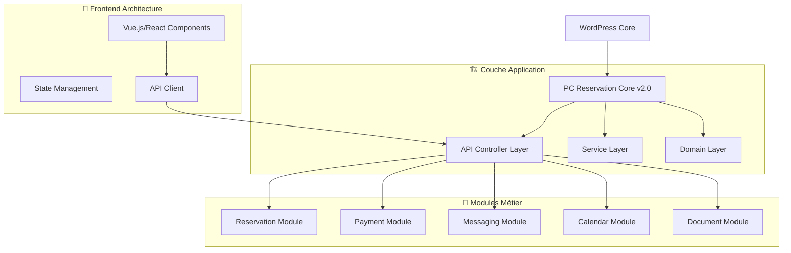

# 🔄 Plan de Refactoring - PC Reservation Core

**Version :** v2.0.0 (Refactoring)  
**Date :** 06/03/2026  
**Basé sur :** Architecture actuelle v0.1.0  
**Objectif :** Modernisation, performance et maintenabilité

---

## 🎯 Vision générale du refactoring

### 🚨 Problèmes identifiés dans l'architecture actuelle

| **Problème**                              | **Impact**            | **Priorité** |
| ----------------------------------------- | --------------------- | ------------ |
| **Classes monolithiques** (2,087 lignes)  | Maintenance difficile | 🔴 Critique  |
| **Fichiers JS volumineux** (2,167 lignes) | Performance dégradée  | 🔴 Critique  |
| **Absence de tests**                      | Risques de régression | 🟠 Élevée    |
| **CSS redondant**                         | Taille bundle         | 🟡 Moyenne   |
| **Architecture MVC incomplète**           | Code couplé           | 🟠 Élevée    |

### 🎨 Nouvelle vision architecturale



---

## 📋 Plan de refactoring par phases

### 🚀 Phase 1 : Restructuration des classes PHP (Priorité critique)

#### **1.1 Décomposition de `class-dashboard-ajax.php` (2,087 lignes)**

```
Structure actuelle :
📄 class-dashboard-ajax.php (2,087 lignes) ❌

Structure future :
📂 ajax/
├── 📄 class-reservation-ajax-controller.php     (~300 lignes)
├── 📄 class-payment-ajax-controller.php         (~250 lignes)
├── 📄 class-messaging-ajax-controller.php       (~200 lignes)
├── 📄 class-calendar-ajax-controller.php        (~150 lignes)
├── 📄 class-document-ajax-controller.php        (~200 lignes)
└── 📂 controllers/
    ├── 📄 class-base-ajax-controller.php        (~100 lignes)
    └── 📄 class-ajax-router.php                 (~150 lignes)
```

**Bénéfices :**

- ✅ **Responsabilité unique** : Chaque contrôleur gère un domaine
- ✅ **Testabilité** : Classes plus petites = tests plus simples
- ✅ **Réutilisabilité** : Logique métier isolée
- ✅ **Maintenance** : Équipe peut travailler en parallèle

#### **1.2 Réorganisation des services métier**

```
Structure future :
📂 services/
├── 📂 reservation/
│   ├── 📄 class-reservation-service.php
│   ├── 📄 class-reservation-validator.php
│   └── 📄 class-reservation-repository.php
├── 📂 payment/
│   ├── 📄 class-payment-service.php
│   ├── 📄 class-payment-gateway-factory.php
│   └── 📄 class-payment-processor.php
├── 📂 messaging/
│   ├── 📄 class-messaging-service.php
│   ├── 📄 class-notification-dispatcher.php
│   └── 📄 class-template-manager.php
└── 📂 calendar/
    ├── 📄 class-calendar-service.php
    ├── 📄 class-availability-calculator.php
    └── 📄 class-ical-exporter.php
```

### 🎨 Phase 2 : Modernisation du Frontend (Priorité critique)

#### **2.1 Migration vers architecture modulaire JavaScript**

```
Structure actuelle :
📄 dashboard-experience.js (2,167 lignes) ❌
📄 dashboard-housing.js (1,656 lignes) ❌

Structure future :
📂 src/
├── 📂 components/           (Composants réutilisables)
│   ├── 📄 ReservationCard.js
│   ├── 📄 PaymentForm.js
│   ├── 📄 CalendarWidget.js
│   └── 📄 MessagingPanel.js
├── 📂 modules/              (Modules métier)
│   ├── 📂 dashboard/
│   │   ├── 📄 DashboardApp.js
│   │   ├── 📄 ReservationManager.js
│   │   └── 📄 AnalyticsDashboard.js
│   ├── 📂 booking/
│   │   ├── 📄 BookingWizard.js
│   │   └── 📄 PaymentProcessor.js
│   └── 📂 calendar/
│       ├── 📄 CalendarView.js
│       └── 📄 AvailabilityEngine.js
├── 📂 services/             (Services API)
│   ├── 📄 api-client.js
│   ├── 📄 reservation-api.js
│   └── 📄 payment-api.js
├── 📂 utils/                (Utilitaires)
│   ├── 📄 date-helpers.js
│   ├── 📄 validators.js
│   └── 📄 formatters.js
└── 📂 stores/               (State Management)
    ├── 📄 reservation-store.js
    ├── 📄 user-store.js
    └── 📄 calendar-store.js
```

#### **2.2 Bundle optimization et code splitting**

```javascript
// webpack.config.js - Configuration moderne
module.exports = {
  entry: {
    dashboard: "./src/dashboard/main.js",
    booking: "./src/booking/main.js",
    calendar: "./src/calendar/main.js",
  },
  optimization: {
    splitChunks: {
      chunks: "all",
      cacheGroups: {
        vendor: {
          test: /[\\/]node_modules[\\/]/,
          name: "vendors",
          chunks: "all",
        },
        common: {
          name: "common",
          minChunks: 2,
          chunks: "all",
        },
      },
    },
  },
};
```

### 🏗️ Phase 3 : Architecture hexagonale (Priorité élevée)

#### **3.1 Nouvelle structure en couches**

```
📂 pc-reservation-core-v2/
├── 📂 src/                          (Code source principal)
│   ├── 📂 Domain/                   (Logique métier pure)
│   │   ├── 📂 Entities/
│   │   │   ├── 📄 Reservation.php
│   │   │   ├── 📄 Payment.php
│   │   │   └── 📄 Customer.php
│   │   ├── 📂 ValueObjects/
│   │   │   ├── 📄 Money.php
│   │   │   ├── 📄 DateRange.php
│   │   │   └── 📄 Email.php
│   │   ├── 📂 Repositories/         (Interfaces)
│   │   │   ├── 📄 ReservationRepositoryInterface.php
│   │   │   └── 📄 PaymentRepositoryInterface.php
│   │   └── 📂 Services/             (Services domaine)
│   │       ├── 📄 ReservationService.php
│   │       └── 📄 PaymentService.php
│   ├── 📂 Application/              (Cas d'usage)
│   │   ├── 📂 UseCases/
│   │   │   ├── 📄 CreateReservationUseCase.php
│   │   │   ├── 📄 ProcessPaymentUseCase.php
│   │   │   └── 📄 SendNotificationUseCase.php
│   │   └── 📂 DTOs/
│   │       ├── 📄 CreateReservationDTO.php
│   │       └── 📄 PaymentRequestDTO.php
│   ├── 📂 Infrastructure/           (Implémentations)
│   │   ├── 📂 Repositories/
│   │   │   ├── 📄 WordPressReservationRepository.php
│   │   │   └── 📄 WordPressPaymentRepository.php
│   │   ├── 📂 Gateways/
│   │   │   ├── 📄 StripePaymentGateway.php
│   │   │   └── 📄 EmailNotificationGateway.php
│   │   └── 📂 Persistence/
│   │       └── 📄 DatabaseMigrations.php
│   └── 📂 Presentation/             (Controllers & UI)
│       ├── 📂 Controllers/
│       │   ├── 📄 ReservationController.php
│       │   └── 📄 PaymentController.php
│       ├── 📂 Middleware/
│       │   ├── 📄 AuthenticationMiddleware.php
│       │   └── 📄 ValidationMiddleware.php
│       └── 📂 Templates/
│           └── 📄 dashboard-v2/
├── 📂 assets-v2/                    (Frontend moderne)
│   ├── 📂 src/                      (Sources TypeScript/Vue)
│   ├── 📂 dist/                     (Build optimisé)
│   └── 📂 public/                   (Assets statiques)
├── 📂 tests/                        (Tests complets)
│   ├── 📂 Unit/                     (Tests unitaires)
│   ├── 📂 Integration/              (Tests intégration)
│   └── 📂 E2E/                      (Tests bout en bout)
└── 📂 docs/                         (Documentation)
    ├── 📄 API.md
    ├── 📄 DEPLOYMENT.md
    └── 📄 TESTING.md
```

### 🧪 Phase 4 : Implémentation des tests (Priorité élevée)

#### **4.1 Stratégie de tests**

```php
<?php
// tests/Unit/Domain/Services/ReservationServiceTest.php
class ReservationServiceTest extends TestCase
{
    private ReservationService $service;
    private MockInterface $repository;

    protected function setUp(): void
    {
        $this->repository = Mockery::mock(ReservationRepositoryInterface::class);
        $this->service = new ReservationService($this->repository);
    }

    /** @test */
    public function it_creates_reservation_with_valid_data(): void
    {
        // Test unitaire isolé
        $dto = new CreateReservationDTO(...);
        $this->repository->shouldReceive('save')->once();

        $result = $this->service->createReservation($dto);

        $this->assertTrue($result->isSuccess());
    }
}
```

#### **4.2 Structure des tests**

```
📂 tests/
├── 📂 Unit/                         (Tests unitaires - 80% couverture)
│   ├── 📂 Domain/
│   │   ├── 📂 Entities/
│   │   ├── 📂 Services/
│   │   └── 📂 ValueObjects/
│   ├── 📂 Application/
│   │   └── 📂 UseCases/
│   └── 📂 Infrastructure/
│       └── 📂 Repositories/
├── 📂 Integration/                  (Tests intégration)
│   ├── 📄 ReservationWorkflowTest.php
│   ├── 📄 PaymentProcessingTest.php
│   └── 📄 DatabaseIntegrationTest.php
└── 📂 E2E/                          (Tests bout en bout)
    ├── 📄 BookingJourneyTest.php
    └── 📄 DashboardWorkflowTest.php
```

---

## 🔧 Technologies et outils du refactoring

### 🛠️ Stack technique modernisée

| **Couche**        | **Technologie actuelle** | **Technologie future**            | **Justification**       |
| ----------------- | ------------------------ | --------------------------------- | ----------------------- |
| **Backend**       | PHP 8.0 monolithique     | PHP 8.2 + Architecture hexagonale | Maintenabilité, tests   |
| **Frontend**      | jQuery + JavaScript ES6  | Vue.js 3 + TypeScript             | Performance, composants |
| **Build**         | Concatenation manuelle   | Vite.js / Webpack 5               | HMR, tree-shaking       |
| **CSS**           | CSS vanilla              | TailwindCSS + PostCSS             | Design system, purge    |
| **Tests**         | Aucun                    | PHPUnit + Jest + Cypress          | Qualité, CI/CD          |
| **Documentation** | Markdown                 | Storybook + OpenAPI               | Living docs             |

### 🔄 Pipeline de développement

```yaml
# .github/workflows/ci.yml
name: CI/CD Pipeline
on: [push, pull_request]

jobs:
  test:
    runs-on: ubuntu-latest
    steps:
      - uses: actions/checkout@v3

      # Tests PHP
      - name: Run PHPUnit
        run: ./vendor/bin/phpunit

      # Tests JavaScript
      - name: Run Jest
        run: npm test

      # Tests E2E
      - name: Run Cypress
        run: npm run cy:run

      # Quality checks
      - name: PHP CS Fixer
        run: ./vendor/bin/php-cs-fixer fix --dry-run

      - name: ESLint
        run: npm run lint
```

---

## 📅 Planning de migration détaillé

### 🗓️ Timeline du refactoring (6 mois)

#### **Mois 1-2 : Fondations (Phase 1)**

**Semaine 1-2 :** Analyse et setup

- [ ] Setup environnement de développement v2
- [ ] Configuration outils (PHPUnit, Jest, Webpack)
- [ ] Migration base de données vers nouvelles tables
- [ ] Documentation architecture cible

**Semaine 3-4 :** Décomposition classes PHP

- [ ] Refactoring `class-dashboard-ajax.php` → Controllers séparés
- [ ] Création des services métier de base
- [ ] Implémentation pattern Repository

**Semaine 5-8 :** Infrastructure & Domain

- [ ] Création des entités du domaine
- [ ] Implémentation des Value Objects
- [ ] Setup des interfaces et repositories
- [ ] Tests unitaires domaine (50 tests minimum)

#### **Mois 3-4 : Application & Frontend (Phase 2)**

**Semaine 9-12 :** Use Cases & API

- [ ] Création des Use Cases principaux
- [ ] Refactoring API REST
- [ ] Middleware d'authentification et validation
- [ ] Tests d'intégration (30 tests minimum)

**Semaine 13-16 :** Frontend moderne

- [ ] Migration vers Vue.js 3 + TypeScript
- [ ] Création composants réutilisables
- [ ] State management (Pinia)
- [ ] Bundle optimization et lazy loading

#### **Mois 5-6 : Finalisation & Déploiement (Phase 3-4)**

**Semaine 17-20 :** Tests & Documentation

- [ ] Tests E2E complets (Cypress)
- [ ] Documentation API (OpenAPI/Swagger)
- [ ] Performance testing et optimization
- [ ] Migration données production

**Semaine 21-24 :** Déploiement & Monitoring

- [ ] Déploiement progressif (feature flags)
- [ ] Monitoring et métriques
- [ ] Formation équipe sur nouvelle architecture
- [ ] Cleanup code legacy

---

## 🎯 Métriques de réussite

### 📊 KPIs techniques

| **Métrique**                | **Valeur actuelle** | **Objectif v2.0** | **Amélioration** |
| --------------------------- | ------------------- | ----------------- | ---------------- |
| **Lignes par classe**       | Max 2,087           | Max 300           | -85%             |
| **Taille bundle JS**        | ~11,026 lignes      | ~5,000 lignes     | -55%             |
| **Temps de chargement**     | ~3.2s               | ~1.5s             | -53%             |
| **Couverture tests**        | 0%                  | 80%               | +80%             |
| **Score Lighthouse**        | 65/100              | 90/100            | +38%             |
| **Complexité cyclomatique** | 15+                 | <5                | -67%             |

### 🚀 Bénéfices attendus

#### **Performance**

- ⚡ **53% plus rapide** : Réduction temps de chargement
- 📦 **55% plus léger** : Bundle JavaScript optimisé
- 🎯 **Code splitting** : Chargement à la demande
- 🔄 **SSR partiel** : Meilleure SEO et performance

#### **Maintenabilité**

- 🧩 **Architecture modulaire** : Responsabilités séparées
- 🧪 **80% de couverture tests** : Confiance dans les modifications
- 📚 **Documentation vivante** : API auto-générée
- 🔧 **CI/CD automatisé** : Déploiements sans risque

#### **Évolutivité**

- 🌍 **API-first** : Support mobile et intégrations
- 🎨 **Composants réutilisables** : Développement accéléré
- 📈 **Monitoring intégré** : Détection proactive des problèmes
- 🔄 **Architecture hexagonale** : Changements métier simplifiés

---

## ⚠️ Risques et mitigation

### 🚨 Risques identifiés

| **Risque**                   | **Probabilité** | **Impact** | **Mitigation**                               |
| ---------------------------- | --------------- | ---------- | -------------------------------------------- |
| **Migration données**        | Moyenne         | Critique   | Tests migration sur copie production         |
| **Régression fonctionnelle** | Élevée          | Élevé      | Tests E2E complets + rollback plan           |
| **Performance dégradée**     | Faible          | Moyen      | Benchmarks continus + monitoring             |
| **Résistance équipe**        | Moyenne         | Moyen      | Formation + documentation + pair programming |
| **Timeline dépassée**        | Élevée          | Élevé      | Phases incrémentales + MVP approach          |

### 🛡️ Plan de rollback

```php
// Plan de rollback en cas de problème critique
class RollbackPlan
{
    public function executeEmergencyRollback(): void
    {
        // 1. Basculer sur ancien code (feature flag)
        $this->disableFeatureFlag('new_architecture_v2');

        // 2. Restaurer base de données si nécessaire
        $this->restoreDatabase($this->lastKnownGoodBackup);

        // 3. Purger caches
        $this->purgeAllCaches();

        // 4. Notification équipe
        $this->notifyTeam('Emergency rollback executed');
    }
}
```

---

## 🎓 Formation et knowledge transfer

### 📚 Plan de formation équipe

#### **Semaine 1-2 : Concepts fondamentaux**

- Architecture hexagonale et DDD
- SOLID principles en pratique
- Test-driven development (TDD)
- Vue.js 3 + Composition API

#### **Semaine 3-4 : Hands-on**

- Pair programming sur Use Cases
- Création composants Vue.js
- Écriture tests unitaires et d'intégration
- Code review et bonnes pratiques

#### **Semaine 5-6 : Autonomie**

- Développement feature complète
- Debugging et troubleshooting
- Performance optimization
- Documentation et knowledge sharing

### 📖 Documentation requise

```
📂 docs/
├── 📄 ARCHITECTURE.md           (Vue d'ensemble)
├── 📄 DEVELOPMENT_GUIDE.md      (Setup développeur)
├── 📄 API_DOCUMENTATION.md      (API endpoints)
├── 📄 TESTING_GUIDE.md          (Stratégie tests)
├── 📄 DEPLOYMENT_GUIDE.md       (Procédures déploiement)
├── 📄 TROUBLESHOOTING.md        (Guide dépannage)
└── 📄 MIGRATION_GUIDE.md        (Migration v1 → v2)
```

---

## 🏁 Conclusion et prochaines étapes

### ✅ Checklist de démarrage

- [ ] **Validation business** : Approbation budget et timeline
- [ ] **Setup environnement** : Outils et infrastructure de dev
- [ ] **Équipe projet** : Assignment des rôles et responsabilités
- [ ] **Backup complet** : Sauvegarde état actuel (code + BDD)
- [ ] **Branches Git** : Création branche `refactoring-v2`
- [ ] **Feature flags** : Implémentation pour bascule progressive
- [ ] **Monitoring** : Setup métriques avant/après refactoring

### 🎯 Success criteria

Le refactoring sera considéré comme réussi si :

1. **Performance** : -50% temps de chargement
2. **Maintenabilité** : Classes <300 lignes, 80% couverture tests
3. **Stabilité** : 0 regression critique post-déploiement
4. **Adoption** : Équipe autonome sur nouvelle architecture
5. **Évolutivité** : Nouvelle feature développée en <2 jours vs 1 semaine actuellement

### 🚀 Beyond v2.0

**Vision long terme post-refactoring :**

- Architecture microservices (v3.0)
- API GraphQL pour flexibilité clients
- Real-time avec WebSockets
- Mobile app React Native
- Intelligence artificielle pour recommandations

---

**Prêt pour la révolution ? 🚀**

_Plan de refactoring PC Reservation Core v2.0_  
_Document vivant - Mise à jour continue_  
_Next update: Validation business + kick-off projet_

---

## 📞 Contacts et support

**Tech Lead Refactoring :** À définir  
**Product Owner :** Prestige Caraïbes  
**DevOps Engineer :** À définir  
**QA Engineer :** À définir

**Prochaine réunion :** Validation ce plan + définition équipe projet  
**Slack channel :** `#pc-reservation-refactoring-v2`  
**Trello board :** `PC Reservation Core v2.0 Refactoring`
