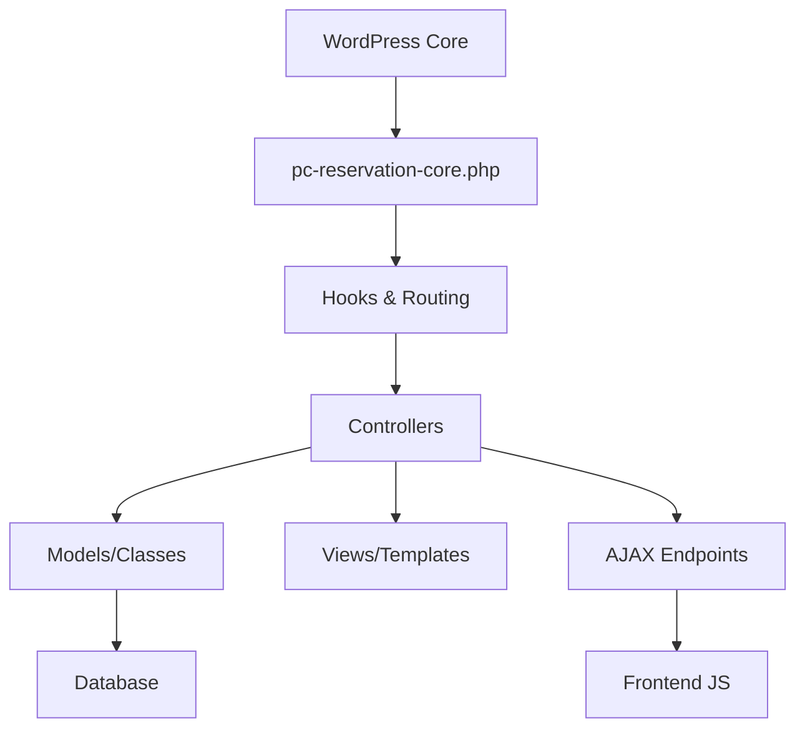

# 🏗️ Architecture Plugin PC-Reservation-Core

**Version :** 0.1.0  
**Auteur :** Prestige Caraïbes  
**Date d'analyse :** 23/02/2026  
**Type :** Plugin WordPress - Système de réservation avancé

---

## 📋 Vue d'ensemble

Le plugin **PC Reservation Core** est un système de gestion de réservations complet pour WordPress, gérant à la fois les **logements** et les **expériences** touristiques. Il constitue le noyau fonctionnel du système de réservation de Prestige Caraïbes.

### 🎯 Fonctionnalités principales

- Gestion des réservations (logements + expériences)
- Système de paiement intégré (Stripe)
- Dashboard propriétaire avec interface moderne
- Calendrier de disponibilités
- Messagerie automatique
- Export iCal
- Gestion des cautions automatiques
- API REST et webhooks

---

## 📊 Statistiques du projet

### 📈 Lignes de code par catégorie

| **Catégorie**          | **Fichiers**  | **Lignes**         | **% du total** |
| ---------------------- | ------------- | ------------------ | -------------- |
| **Core PHP**           | 24 fichiers   | **15,791 lignes**  | **52.3%**      |
| **JavaScript**         | 11 fichiers   | **11,026 lignes**  | **36.5%**      |
| **CSS**                | 9 fichiers    | **7,826 lignes**   | **25.9%**      |
| **Templates**          | 5 fichiers    | **2,234 lignes**   | **7.4%**       |
| **Vendors (Composer)** | 200+ fichiers | **80,000+ lignes** | **~200%**      |

**Total plugin (sans vendors) : 30,203 lignes**  
**Total avec dépendances : ~110,000 lignes**

---

## 🗂️ Structure des dossiers

```
pc-reservation-core/
├── 📄 pc-reservation-core.php        (325 lignes) - Point d'entrée principal
├── 📄 composer.json                  - Dépendances (DomPDF, etc.)
├── 📂 db/                           - Base de données
│   └── schema.php                    (237 lignes) - Création des tables
├── 📂 includes/                     - Classes métier (15,791 lignes)
│   ├── class-reservation.php         (295 lignes)
│   ├── class-dashboard-ajax.php      (2,087 lignes) ⭐
│   ├── class-housing-manager.php     (1,256 lignes)
│   ├── class-experience-manager.php  (1,121 lignes)
│   ├── class-documents.php           (2,004 lignes) ⭐
│   ├── class-messaging.php           (1,707 lignes) ⭐
│   ├── class-booking-engine.php      (799 lignes)
│   ├── class-settings.php            (914 lignes)
│   ├── gateways/                     - Intégrations paiement
│   │   ├── class-stripe-manager.php  (525 lignes)
│   │   ├── class-stripe-ajax.php     (232 lignes)
│   │   └── class-stripe-webhook.php  (163 lignes)
│   └── api/                          - API REST
│       └── class-rest-webhook.php    (416 lignes)
├── 📂 assets/                       - Ressources frontend (18,852 lignes)
│   ├── css/                          (7,826 lignes)
│   │   ├── dashboard-experience.css  (1,533 lignes) ⭐
│   │   ├── dashboard-housing.css     (1,550 lignes) ⭐
│   │   ├── dashboard-messaging.css   (1,187 lignes)
│   │   └── pc-calendar.css           (1,046 lignes)
│   └── js/                           (11,026 lignes)
│       ├── dashboard-experience.js   (2,167 lignes) ⭐
│       ├── dashboard-housing.js      (1,656 lignes) ⭐
│       ├── modules/
│       │   ├── messaging.js          (1,846 lignes) ⭐
│       │   ├── booking-form.js       (1,315 lignes)
│       │   └── documents.js          (507 lignes)
│       └── pc-calendar.js            (1,393 lignes)
├── 📂 shortcodes/                   - Affichage frontend (3,673 lignes)
│   ├── shortcode-experience.php      (1,377 lignes) ⭐
│   ├── shortcode-housing.php         (1,180 lignes)
│   ├── shortcode-dashboard.php       (898 lignes)
│   └── shortcode-calendar.php        (218 lignes)
└── 📂 templates/                    - Vues (2,234 lignes)
    ├── app-shell.php                 (632 lignes)
    └── dashboard/
        ├── list.php                  (1,222 lignes) ⭐
        ├── modal-messaging.php       (173 lignes)
        └── popups.php                (193 lignes)
```

⭐ _= Fichiers les plus volumineux_

---

## 🏛️ Architecture technique

### 🎯 Patron architectural : **MVC + Plugin WordPress**

Le plugin suit une architecture **Model-View-Controller** adaptée à l'écosystème WordPress :



### 🔧 Composants principaux

#### 1. **Base de données** (`db/schema.php`)

- `pc_reservations` : Table principale des réservations
- `pc_payments` : Suivi des paiements
- `pc_messages` : Système de messagerie
- `pc_unavailabilities` : Gestion des indisponibilités

#### 2. **Contrôleurs métier** (`includes/`)

- `PCR_Dashboard_Ajax` : Hub AJAX principal (2,087 lignes)
- `PCR_Housing_Manager` : Gestion logements (1,256 lignes)
- `PCR_Experience_Manager` : Gestion expériences (1,121 lignes)
- `PCR_Messaging` : Messagerie automatique (1,707 lignes)
- `PCR_Documents` : Génération PDF (2,004 lignes)

#### 3. **Interface utilisateur** (`assets/`)

- **CSS modulaire** : 9 fichiers spécialisés (7,826 lignes)
- **JavaScript ES6** : Architecture modulaire (11,026 lignes)
- **Composants UI** : Dashboard moderne avec AJAX

#### 4. **Intégrations externes**

- **Stripe** : Paiements + cautions automatiques
- **iCal** : Export calendrier
- **DomPDF** : Génération documents

---

## 🔄 Flux de données

### 📍 Cycle de vie d'une réservation

```
1. [Frontend] Formulaire de réservation
   ↓
2. [AJAX] class-dashboard-ajax.php
   ↓
3. [Validation] class-booking-engine.php
   ↓
4. [Database] wp_pc_reservations
   ↓
5. [Paiement] class-stripe-manager.php
   ↓
6. [Notification] class-messaging.php
   ↓
7. [Documents] class-documents.php
```

### 🎛️ Points d'entrée principaux

| **Entrée**                  | **Responsable**                     | **Usage**          |
| --------------------------- | ----------------------------------- | ------------------ |
| `/espace-proprietaire`      | Routing WordPress + `app-shell.php` | Dashboard SPA      |
| `admin-ajax.php`            | `class-dashboard-ajax.php`          | API AJAX           |
| `[pc_dashboard_housing]`    | `shortcode-housing.php`             | Widget logements   |
| `[pc_dashboard_experience]` | `shortcode-experience.php`          | Widget expériences |
| `/wp-json/pc/v1/webhook`    | `class-rest-webhook.php`            | API REST           |

---

## 🎨 Patterns de conception utilisés

### 1. **Singleton Pattern**

```php
// Toutes les classes principales utilisent ce pattern
class PCR_Housing_Manager {
    public static function init() {
        // Une seule instance
    }
}
```

### 2. **Factory Pattern**

```php
// Création dynamique selon le type de réservation
PCR_Booking_Engine::create_reservation($type, $data);
```

### 3. **Observer Pattern**

```php
// Hooks WordPress pour les événements
add_action('pc_reservation_created', [...]);
add_action('pc_payment_completed', [...]);
```

### 4. **Strategy Pattern**

```php
// Différentes stratégies de paiement
class PCR_Stripe_Manager // Stratégie Stripe
class PCR_PayPal_Manager // Stratégie PayPal (futur)
```

---

## ⚡ Performance et optimisations

### 🚀 Points forts

- **AJAX moderne** : Chargement asynchrone
- **CSS modulaire** : Chargement conditionnel
- **Cache WordPress** : Utilisation des transients
- **Lazy loading** : Assets chargés à la demande
- **Minification** : Assets optimisés

### 🐌 Points d'amélioration identifiés

| **Problème**                          | **Impact**          | **Solution recommandée**     |
| ------------------------------------- | ------------------- | ---------------------------- |
| Fichiers JS volumineux (2,167 lignes) | Performance         | Code splitting + modules ES6 |
| Classes monolithiques (2,087 lignes)  | Maintenance         | Refactoring en sous-classes  |
| Dépendances composer lourdes          | Temps de chargement | Évaluer alternatives légères |
| CSS redondant                         | Taille finale       | Audit et nettoyage           |

---

## 🔐 Sécurité

### ✅ Mesures implémentées

- **Nonces WordPress** : Protection CSRF
- **Sanitization** : Validation des données
- **Capability checks** : Vérification des permissions
- **SQL préparé** : Protection injection SQL
- **Webhooks sécurisés** : Vérification signatures

### 🛡️ Recommandations

- [ ] Audit sécurité complet
- [ ] Rate limiting sur AJAX
- [ ] Chiffrement données sensibles
- [ ] Logs d'audit

---

## 📦 Dépendances externes

### Composer (vendor/)

- **dompdf/dompdf** (~30,000 lignes) : Génération PDF
- **masterminds/html5** (~15,000 lignes) : Parser HTML
- **sabberworm/php-css-parser** (~10,000 lignes) : Parser CSS

### JavaScript (CDN)

- **jQuery** : Manipulation DOM
- **Select2** : Composants de sélection avancés
- **Chart.js** : Graphiques dashboard

---

## 🔧 APIs et intégrations

### 🌐 API REST WordPress (`/wp-json/pc/v1/`)

- `POST /webhook` : Réception webhooks externes
- Authentification via tokens

### 🎯 AJAX WordPress (`admin-ajax.php`)

- `pc_get_reservations` : Liste des réservations
- `pc_create_reservation` : Création réservation
- `pc_send_message` : Envoi message
- `pc_process_payment` : Traitement paiement

### 🔗 Webhooks sortants

- Stripe : Événements paiement
- Calendriers externes : Synchronisation
- CRM : Leads automatiques

---

## 🧪 Tests et qualité

### ❌ Points manquants

- [ ] Tests unitaires
- [ ] Tests d'intégration
- [ ] Tests E2E
- [ ] Documentation technique

### ✅ Outils recommandés

- **PHPUnit** : Tests unitaires PHP
- **Jest** : Tests JavaScript
- **Cypress** : Tests E2E
- **PHP_CodeSniffer** : Standards de code

---

## 🚀 Évolutions futures recommandées

### 📈 Court terme (Q1 2026)

1. **Refactoring** : Diviser les classes monolithiques
2. **Performance** : Optimisation des assets
3. **Tests** : Couverture de base (50%)
4. **Documentation** : API et hooks

### 🎯 Moyen terme (Q2-Q3 2026)

1. **API REST complète** : Exposition publique
2. **Multi-devises** : Support international
3. **Multi-langues** : i18n complet
4. **Mobile app** : Interface native

### 🌟 Long terme (2027+)

1. **Microservices** : Architecture distribuée
2. **Real-time** : WebSocket pour notifications
3. **AI/ML** : Recommandations intelligentes
4. **Blockchain** : Contrats intelligents

---

## 📝 Notes techniques importantes

### 🔄 Migration de données

Le plugin inclut un système de migration pour les mises à jour :

```php
// Auto-migration des tables
PCR_Reservation_Schema::migrate_existing_messages();
```

### 🎨 Système de templates

```php
// Templates modulaires et surchargeables
PC_RES_CORE_PATH . 'templates/app-shell.php'
```

### ⚙️ Configuration

```php
// Constantes principales
define('PC_RES_CORE_VERSION', '0.1.0');
define('PC_RES_CORE_PATH', plugin_dir_path(__FILE__));
```

---

## 👥 Équipe et contacts

**Lead Developer :** Prestige Caraïbes  
**Architecture :** MVC + WordPress Hooks  
**Stack technique :** PHP 8.0+, MySQL 8.0+, JavaScript ES6+  
**Environnement :** WordPress 6.0+, Local by Flywheel

---

_Document généré automatiquement le 23/02/2026_  
_Dernière mise à jour : Version 0.1.0_
